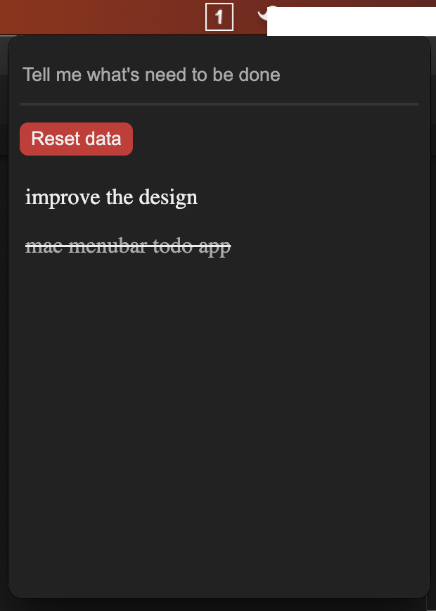

## Ido

Focus on one thing at a time, (productivity app to help you manage your task)

## Running

1. `yarn`
2. `yarn start` to run as a menu bar
3. `yarn start:detached` to run as a detached window. Kinda handy for debugging
